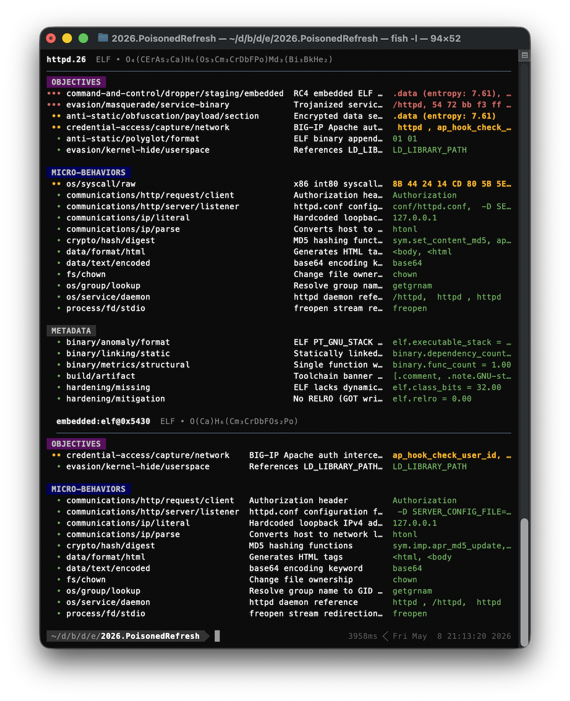

# cleave

[](https://github.com/atomdrift-project/cleave/releases/latest)
[](LICENSE)

cleave is an open-source static analysis engine that answers a practical
question: **what can this program do?** It unpacks files, extracts structural
facts and capabilities, and matches them against the public
[Atomdrift traits](https://github.com/atomdrift-project/traits) rule set.

Use it to triage an unfamiliar artifact, compare two releases, or produce
structured features for another security tool. Analysis runs locally; files are
not uploaded and no API key or GPU is required.

<p align="center">
  
</p>

## Why cleave?

- **Software-aware analysis.** Understands source, binaries, bytecode,
  documents, packages, disk images, and nested archives.
- **Capabilities instead of signatures alone.** Reports behaviors such as
  credential access, persistence, execution, evasion, and data transfer.
- **Evidence you can inspect.** Findings point back to strings, symbols,
  imports, metadata, paths, or structural facts from the input.
- **Useful in automation.** Terminal, JSON, and streaming JSONL output are
  available from the same CLI and Rust library.
- **Release-to-release comparison.** `cleave diff` highlights newly introduced
  capabilities and structural changes.

## Install

### Homebrew on macOS or Linux

```bash
brew install atomdrift-project/tap/cleave
```

### Build from source

Source builds require Git, Make, a C/C++ toolchain, and Rust 1.94 or newer.

```bash
git clone https://github.com/atomdrift-project/cleave.git
cd cleave
make install
```

For deeper binary analysis, install
[Rizin](https://github.com/rizinorg/rizin). [UPX](https://upx.github.io/) is
optional and adds runtime unpacking for supported files.

### First run

```bash
cleave --version
cleave suspect.bin
```

The first analysis downloads the compatible traits bundle if one is not
already installed. cleave also performs a best-effort release notice check at
most once every 24 hours. To run without that check after installing the bundle:

```bash
CLEAVE_NO_UPDATE_CHECK=1 cleave suspect.bin
```

## Quick start

```bash
# Analyze one artifact or recursively inspect a directory.
cleave suspect.bin
cleave ./unpacked-release

# Emit one JSON object for a complete report, or stream files as JSONL.
cleave --format json suspect.bin
cleave --format jsonl ./samples

# Show only suspicious and hostile findings.
cleave --min-crit suspicious suspect.bin

# Compare an old release with a candidate release.
cleave diff v1.2.0/ v1.3.0/

# Show the installed traits revision and exact rule inventory.
cleave version
```

Given the same bytes, traits bundle, options, and installed analysis tools,
cleave's findings are deterministic. Reports include an analysis timestamp, so
serialized output is not byte-for-byte identical between runs.

## What it analyzes

Representative coverage includes:

| Category | Examples |
| --- | --- |
| **Binaries and bytecode** | Mach-O, ELF, PE, WebAssembly, Android DEX, Java `.class`, Python `.pyc`, BEAM, MSI, CHM |
| **Source** | Python, JavaScript, TypeScript, Go, Rust, C/C++, Java, Kotlin, C#, Swift, Objective-C, Ruby, PHP, Perl, Lua, Shell, PowerShell, Scala, Groovy, Zig, Elixir, Clojure |
| **Archives and packages** | ZIP, TAR, 7-Zip, RAR, CAB, JAR, deb, rpm, APK, npm, wheel, gem, crate, NuGet, CRX, XPI, VSIX, IPA |
| **Documents and data** | PDF, RTF, Office/OLE2, OOXML, OpenDocument, LNK, plist, HTML, XML, SVG, Markdown, JPEG, PNG |
| **Build and deployment files** | package manifests, lockfiles, GitHub Actions, Dockerfile, Makefile, systemd units, XDG desktop files |

See [FILE_FORMATS.md](FILE_FORMATS.md) for the maintained coverage reference.

## How it works

1. [filefacts](https://github.com/atomdrift-project/filefacts) identifies and
   parses the input into reusable structural views.
2. cleave recursively opens supported containers and enriches executable facts
   with optional Rizin and UPX analysis.
3. YAML, YARA-X, and composite traits turn those facts into named capabilities
   aligned broadly with MBC and MITRE ATT&CK.
4. Results are ranked from `baseline` through `hostile` and emitted for a human
   or downstream program.

Run `cleave version` for the exact atomic, composite, and third-party YARA rule
counts installed on your machine.

## Documentation

- [Integration guide](docs/INTEGRATION.md) — CLI, library, or HTTP server
- [JSON schema](docs/JSON.md) — report structure
- [Rust API](docs/RUST_API.md) — embedding cleave
- [Server API](docs/SERVER_API.md) — long-running analysis service
- [Rule authoring](https://github.com/atomdrift-project/traits/blob/main/RULES.md)

Issues and pull requests are welcome in the
[GitHub repository](https://github.com/atomdrift-project/cleave).

## License

cleave is available under the [Apache License 2.0](LICENSE).
