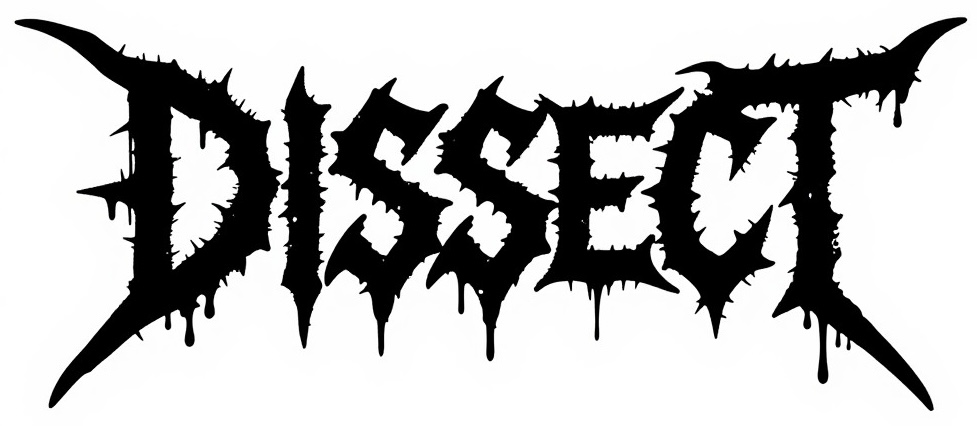

# cleave

Deep static analysis for threat detection across binaries and source code. AST-aware, not regex-blind.

cleave understands code semantics—it won't mistake a string literal `"exec"` for actual execution. It combines abstract syntax tree inspection with binary reverse engineering to detect capabilities and behaviors across 20+ languages and three binary formats in a single pass.

## Why It Exists

Most tools are either:
- **Text-based**: YARA/regex patterns that hallucinate threats in benign strings
- **Single-format**: Handle binaries or source, not both
- **Language-blind**: Ignore syntax trees, miss semantic intent

cleave does all three. It's built for supply chain defenders and threat hunters who need AST-level certainty for source code and deep symbol/string analysis for binaries. It catches what obfuscation and polymorphism hide from simpler tools.

## What It Analyzes

- **Binaries**: Mach-O, ELF, PE
- **Source**: Shell, Python, JavaScript, TypeScript, Go, Rust, Java, Ruby, C, PHP, Lua, Perl, PowerShell, C#, Swift, Objective-C, Groovy, Scala, Zig, Elixir
- **Packages**: npm, Chrome extensions, VSCode extensions
- **Archives**: ZIP, TAR, 7z, RAR, XAR (unpacked recursively)
- **Bytecode**: Java .class files and JAR constant pool analysis

## Try It!

Try our [demo web interface](https://cleave-web-362492245899.us-central1.run.app/) if you are curious about real-world behavior.

## Quick Start

```bash
cargo build --release

# Single target
cleave binary-or-source.py

# Supply chain diffing
cleave diff old-version/ new-version/ --json

# Deep inspection
cleave symbols firmware.bin
cleave strings malware.exe --min-length 10
```

## Detection Philosophy

Rules follow [MBC (Malware Behavior Catalog)](https://github.com/MBCProject/mbc-markdown) hierarchy:

- **Traits** (`micro-behaviors/`): Atomic detections—individual capabilities with no judgment
- **Composites** (`objectives/`): Behavioral patterns—traits combined into tactics and objectives
- **Known** (`well-known/`): Malware families and tool signatures

Confidence ranges from 1.0 (AST-level certainty) to heuristic matches (0.7–0.9). Criticality is independent of confidence—a socket import is certain but baseline; a Telegram API endpoint is uncertain but hostile.

## Output

Structured JSON for integration with threat intel platforms, SOAR systems, or ML pipelines. Terminal output is color-coded: 🔴 hostile, 🟡 suspicious, 🔵 notable, ⚪ baseline.

## Under the Hood

- **Tree-sitter** for language-aware AST traversal
- **Radare2/Rizin** for deep binary reverse engineering (functions, control flow, syscalls, sections)
- **Goblin** for binary header parsing (Mach-O, ELF, PE)
- **YARA-X** for signature matching
- **Payload decoding**: Base64, hex, AES, XOR key material

## Documentation

- [RULES.md](./RULES.md) — Rule design and MBC philosophy
- [TAXONOMY.md](./TAXONOMY.md) — Full trait catalog (791 detections)

## License

Apache-2.0
