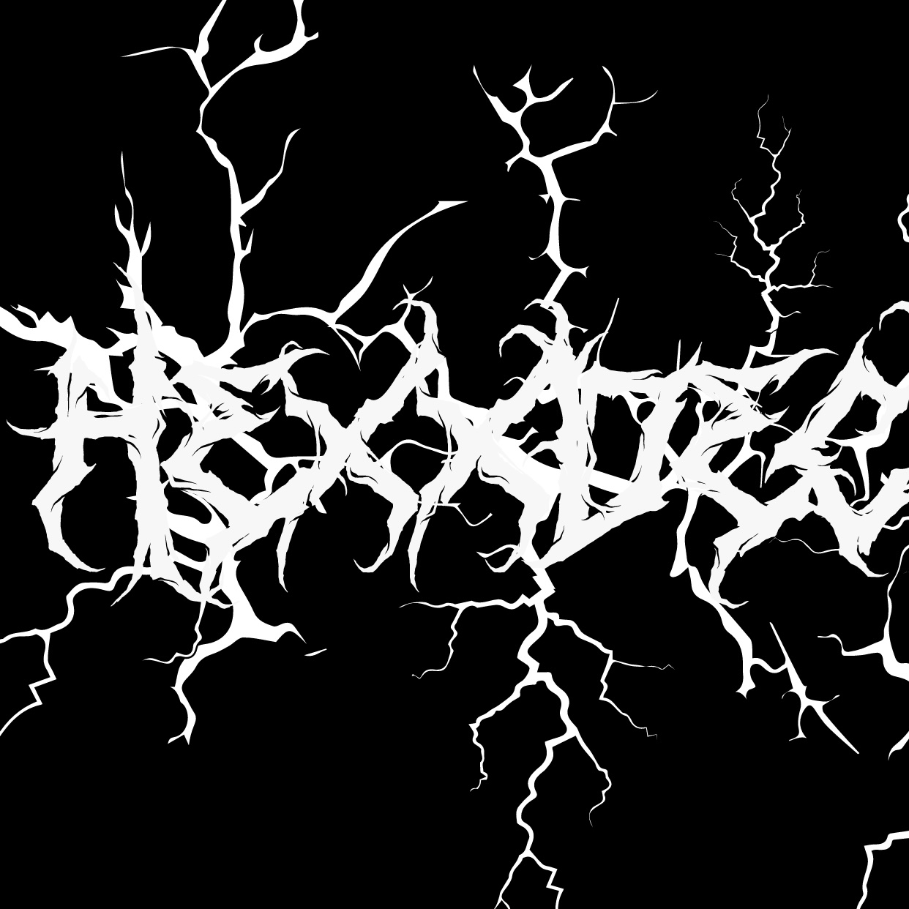
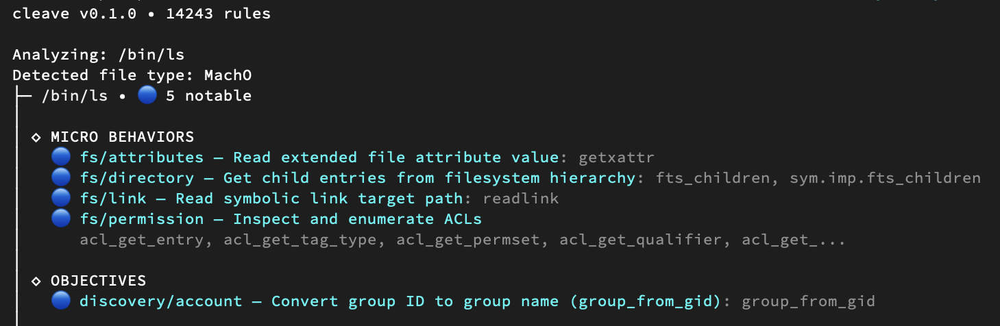

AST-aware software decomposition. Takes binaries and source apart into their atomic components.

cleave understands code semantics—it won't mistake a string literal `"exec"` for actual execution. It combines abstract syntax tree inspection with binary reverse engineering to detect capabilities and behaviors across 20+ languages and three binary formats in a single pass.



## Why It Exists

Most tools are either:
- **Text-based**: YARA/regex patterns that hallucinate threats in benign strings
- **Single-format**: Handle binaries or source, not both
- **Language-blind**: Ignore syntax trees, miss semantic intent

cleave does all three. It's built for supply chain defenders and threat hunters who need AST-level certainty for source code and deep symbol/string analysis for binaries. It catches what obfuscation and polymorphism hide from simpler tools.

## What It Analyzes

- **Binaries**: Mach-O, ELF, PE
- **Source**: Shell, Python, JavaScript, TypeScript, Go, Rust, Java, Ruby, C, PHP, Lua, Perl, PowerShell, C#, Swift, Objective-C, Groovy, Scala, Zig, Elixir
- **Packages**: npm, Chrome extensions, VSCode extensions
- **Archives**: ZIP, TAR, 7z, RAR, XAR (unpacked recursively)
- **Bytecode**: Java .class files and JAR constant pool analysis

## Requirements

- A modern version of [Rust](https://rust-lang.org/)
- OPTIONAL: [rizin](https://github.com/rizinorg/rizin) for binary reverse-engineering
- OPTIONAL: [upx](https://github.com/upx/upx) for on-the-fly unpacking

## Quick Start

```bash
cargo install --path .

# Analyze target
cleave binary-or-source.py

# Analyze directory recursively (including archives)
cleave /tmp/box-o-malware
```

## Detection Philosophy

Rules follow [MBC (Malware Behavior Catalog)](https://github.com/MBCProject/mbc-markdown) hierarchy:

- **Traits** (`micro-behaviors/`): Atomic detections—individual capabilities with no judgment
- **Composites** (`objectives/`): Behavioral patterns—traits combined into tactics and objectives
- **Known** (`well-known/`): Malware families and tool signatures

Confidence ranges from 1.0 (AST-level certainty) to heuristic matches (0.7–0.9). Criticality is independent of confidence—a socket import is certain but baseline; a Telegram API endpoint is uncertain but hostile.

## Competition

- cleave was created by the author of [malcontent](https://github.com/chainguard-dev/malcontent): in comparison, cleave offers twice the rule coverage, adds AST parsing, binary reverse engineering, proper handling of Rust/Go strings, and much better encoded payload detection.
- [capa](https://github.com/mandiant/capa) was our original inspiration. cleave is much faster, with 15X the rule coverage, and significantly broader file format support (such as machO, Python, Shell, etc). 

## Under the Hood

- **Tree-sitter** for language-aware AST traversal
- **Radare2/Rizin** for deep binary reverse engineering (functions, control flow, syscalls, sections)
- **Goblin** for binary header parsing (Mach-O, ELF, PE)
- **YARA-X** for signature matching
- **Payload decoding**: Base64, hex, AES, XOR key material

## Documentation

- [RULES.md](./RULES.md) — Rule design and MBC philosophy
- [TAXONOMY.md](./TAXONOMY.md) — Full trait catalog (791 detections)

## License

Apache-2.0
