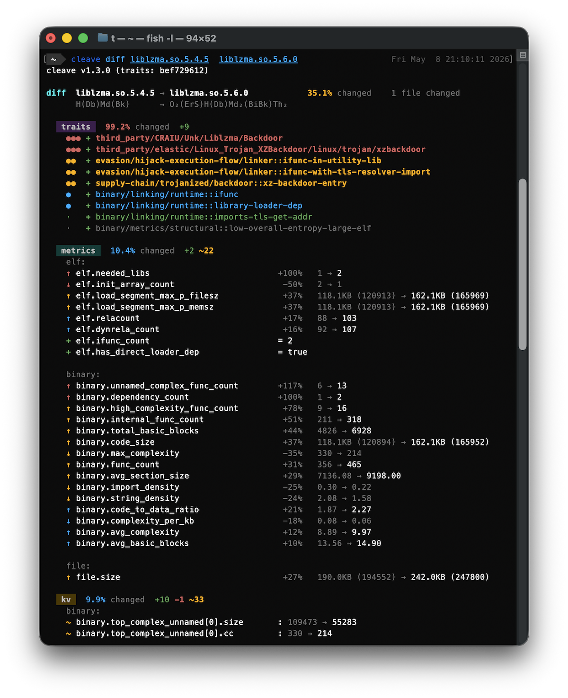

<p align="center">
  
</p>

cleave answers one question — *what can this program do?* It extracts capabilities from binaries, source, and archives, scoring each against **[92,000+ behavior rules](https://github.com/atomdrift-project/traits)** aligned to [MBC](https://github.com/MBCProject/mbc-markdown) and [ATT&CK](https://attack.mitre.org/). Apache-2.0, no telemetry.

- **Interactive supply-chain & malware triage.** Run on a release, a suspicious sample, or a directory of dropped files. `cleave diff old/ new/` highlights new capabilities, tampered headers, and provenance anomalies between versions.
- **Feature extraction for ML/AI pipelines.** Stable JSON schema, deterministic output, SHA256-keyed cache. [scan](https://github.com/atomdrift-project/scan) is the reference downstream classifier.

## Screenshots

analyze (recent ELF malware sample, but cleave also supports source code)


diff (the infamous xzutils case)



## What cleave analyzes

- **Binaries**: Mach-O, ELF, PE, WebAssembly, MSI, CHM, PyInstaller, Java `.class`, Android DEX, Python `.pyc`, Python pickle, Erlang/Elixir BEAM, compiled AppleScript, static libs (`.a`)
- **Source** (~24 langs, tree-sitter): Python, JS/TS, Go, Rust, C/C++, Java, Kotlin, C#, Swift, ObjC, Ruby, PHP, Perl, Lua, Shell, PowerShell, Groovy, Scala, Zig, Elixir, Clojure, Batch, VBScript, Makefile, Dockerfile
- **Archives** (recursive): zip, tar (gz/bz2/xz/zst), 7z, rar, cab, jar/war, deb, rpm, pkg, apk, gem, crate, whl, nupkg, phar, vsix, xpi, crx, ipa, epub
- **Documents & data**: PDF, RTF, LNK, Office (OLE2 + OOXML), OpenDocument, plist, HTML, XML, Markdown, PNG/JPEG, package manifests, GitHub Actions, systemd units, XDG `.desktop`

See [FILE_FORMATS.md](FILE_FORMATS.md) for more info.

## Quick Start

```bash
make install                                  # via cargo
brew install atomdrift/tap/cleave             # macOS / Linux
```

```bash
cleave suspect.bin                            # single sample
cleave /tmp/box-o-malware                     # recursive, unpacks archives
cleave diff v1.2.0/ v1.3.0/                   # release-to-release diff
cleave --format jsonl --min-crit suspicious   # streaming JSON for pipelines
```

Optional: [rizin](https://github.com/rizinorg/rizin) for disassembly, [upx](https://github.com/upx/upx) for runtime unpacking.

## Platforms

Known to run awesomely on illumos, OpenBSD, FreeBSD, Linux, and macOS.

## Design

- **Capabilities, not verdicts.** Findings ranked `baseline` → `hostile`, organized roughly based on the [Malware Behavior Catalog](https://github.com/MBCProject/mbc-markdown).
- **Layered unpacking.** UPX, embedded binaries, base64/hex/AES/XOR via [stng](https://github.com/atomdrift-project/stng).
- **Deep header inspection.** PE manifests/signing, Mach-O codesign/entitlements, DWARF, Go build info, embedded plists.
- **Automated RE.** [rizin](https://github.com/rizinorg/rizin)-driven disassembly and xrefs on ELF/Mach-O/PE.
- **Deterministic.** JSONL streaming, SHA256-keyed cache, AST via tree-sitter, YAML & YARA-X for signatures.

## Docs

- [docs/INTEGRATION.md](docs/INTEGRATION.md) — picking a path: CLI, library, or server
- [docs/RUST_API.md](docs/RUST_API.md) — Rust library API
- [docs/SERVER_API.md](docs/SERVER_API.md) — `cleave serve` HTTP endpoints
- [docs/JSON.md](docs/JSON.md) — JSON report schema

## Rules

- [traits](https://github.com/atomdrift-project/traits)
- [RULES.md](https://github.com/atomdrift-project/traits/blob/main/RULES.md)
- [TAXONOMY.md](https://github.com/atomdrift-project/traits/blob/main/TAXONOMY.md)

## Related Projects

- [malcontent](https://github.com/chainguard-dev/malcontent) (predecessor, 3× less coverage)
- [capa](https://github.com/mandiant/capa) (original inspiration, slow, limited filetypes, but thorough)
